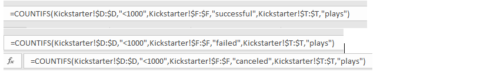

# Kickstarting with Excel

## Overview and Purpose

This project has been undertaken to help Louise launch her play “Fever” successfully. Since Louise is interested in the “Theatre” category, we have filtered out the data from other categories and performed the analysis based on theatres only. The project will help Louise understand how different theatre campaigns fared according to their launch dates. We have also divided the goal amounts into different classes to provide a clearer picture regarding the outcomes of the plays.

### Analysis and Challenges

We have performed two types of technical analysis in this project-
    -Theatre Outcomes based on Launch Dates 
    -Outcomes based on Goals.

1.	Outcomes Based on Launch Dates –
-	Converted the launch date from Unix timestamp and used the =Year() function to extract the year from the date.
-	
-	Created Pivot Table based on Launched Date and Outcomes
-	Filtered the parent category and selected “Theatre”.
-	Grouped the years into months to show the number of successful, failed and canceled theatre campaigns according to months.
-	
-	
-	Finally,inserted a Line Chart to visualize the relationship between outcomes and launch dates.
-	

2.	Outcomes Based on Goals 
–Created a new Excel sheet to calculate the number of successful, failed and cancelled plays by dividing the goal amounts into different classes.

-	Used the =COUNTIFS function in Excel to calculate the number of successful/failed/canceled plays for the different classes of the goal amounts.
-	
-	Added the total number of plays under each goal class and calculated the percentage of successful/failed/canceled campaigns for each class.
-	
-	Inserted a line chart to visualize the relationship between the goal amount ranges and the percentage of successful/failed/canceled plays.
-	
-	The main challenge I faced was with the COUNTIFS function. Although I knew the logic behind the function, I was not sure how to implement the same for a range like “1000-4999”. To overcome the challenge, I went through the hint video available on canvas several times to fully understand the concept. The video also helped me figure out that I needed to use Absolute Cell Reference to get the correct figures.

#### Analysis of Outcomes Based on Launch Date

The outcomes based on Launch Dates helps to understand that a campaign launched around May and June has the highest chance of becoming successful. It is better to avoid December and January since the ratio of successful to failed is pretty low and there are high chances of cancellations in January. 

#### Analysis of Outcomes Based on Goals

Theatre plays are mostly successful when the goal amounts are less than $5000.There are very few successful theatre campaigns above $15,000 goal amount. All theatre campaigns between the $45000 and $49999 range have failed. 

#### What are two conclusions you can draw about the Outcomes based on Launch Date?

1.	The most number of successful campaigns are in May (111),followed by June (100).
2.	Highest number of theatre cancellations are in January (7).

#### What can you conclude about the Outcomes based on Goals?

- Plays within a goal range of $5000 have been successful. As the goal amount goes higher, the percentage of successful plays reduces with 0% successes within the goal range of $45,000 and $49,999.

#### What are some limitations of this dataset?

-	The dataset is not very current. It only includes information about theatre campaigns launched till 2017.
-	The dataset includes campaigns from different countries with different currencies but the goal and pledged amounts mentioned are in dollars.
-	The data provided in the Spotlight and Staff Pick columns are not clear and therefore could not be analyzed.

#### What are some other possible tables and/or graphs that we could create?

-	We can perform a descriptive analysis on the data (goal and pledged amounts) to find the central tendency and variability and plot it on a Box and Whisker chart for visualization.
-	We could also analyze the data by filtering the country to check where theatre campaigns have the highest chance of success.

 

